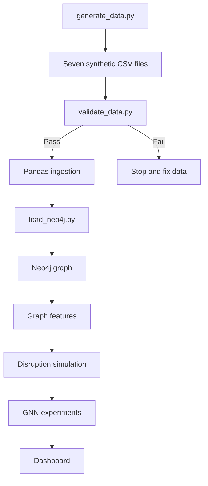

# Architecture

```mermaid
flowchart TD
 A[generate_data.py] --> B[Seven synthetic CSV files]
 B --> C[validate_data.py]
 C -->|Pass| D[Pandas ingestion]
 C -->|Fail| E[Stop and fix data]
 D --> F[load_neo4j.py]
 F --> G[Neo4j graph]
 G --> H[Graph features]
 H --> I[Disruption simulation]
 I --> J[GNN experiments]
 J --> K[Dashboard]
```

The first working milestone is generation, validation, and Neo4j loading. Feature engineering, simulation, GNN training, and dashboard are future work.
